# Week 8 - Feedback Review and PlayingCards.io Introduction
Today you will be given the chance to go over your Level Design Assignment feedback with your instructor and begin exploring the playingcards.io tool you will be using for the final assignment.

Today is less prescriptive than the previous weeks. We want to give you a chance to play around with the tools within playingcards.io, and so are not suggesting an exact deliverable or thing to finish today. Experiment, have fun, and learn the ins-and-outs of the tool!

## Tools used
Today's task uses (but is not limited to):

* iLearn (for getting your feedback)
* playingcards.io

## Assignment deliverable
Today's work will not directly translate into an assignment deliverable but instead be about learning the new tool you will need later.

## Assignment Feedback
We have not assigned a particular time to this task, as it is dependent on when your instructor gets around to you. Have a look on iLearn at the feedback you received for your level design assignment. Ask yourself the following:

* Does the feedback given make sense?
  * Is there anything your marker says that is unclear?
* Is there an indication of ways you can improve?
  * If so, what are they?
  * If not, what do you think you could do next time to improve?
    
Note: This is not an opportunity to appeal your mark. If you believe your mark contains an error, please contact the course convenors.

Make a few notes on these questions and anything else you'd like to talk to your instructor about and call them over (you may wish to start on other parts of today's task while you wait). Please be respectful of time - your instructor will need to have the opportunity to give equal feedback to all in the class, so allow them to move on when they need to.

## Getting Started with playingcards.io (20 min)
For the final assignment, you will be creating a tabletop card game. While you will be expected to produce and playtest with paper prototypes, the final submission will be a digitised version created using [playingcards.io](https://playingcards.io/). Let's take some time to get familiar with the tool.

### What is playingcards.io?
playingcards.io is a free to use tool for making and playing tabletop games online. The site allows you to create "rooms" where you can set-up tables with cards, tokens, dice and more. You can use this platform to play established games, or add your own cards and resources to create custom games.

"Rooms" can be exported ready to go, bundled with all custom assets (such as cards). We will be using this tool to have you submit your final game, as this best simulates a real-life card game scenario without worrying about printing and other resource restrictions.

### Setting up
Head to the website and press `Log In / Sign Up` to make an account. Follow the prompts to create your account. You do not need to sign up for a subscription.

Head to the `Games` menu and select a game. We recommend selecting one you are relatively familiar with, so you can better understand the mechanics at play.

When beginning a game, you will have a pop-up window providing you with a code. This code is the "room code" and is used to bring other people into the game. Note it down, we will revisit this later.

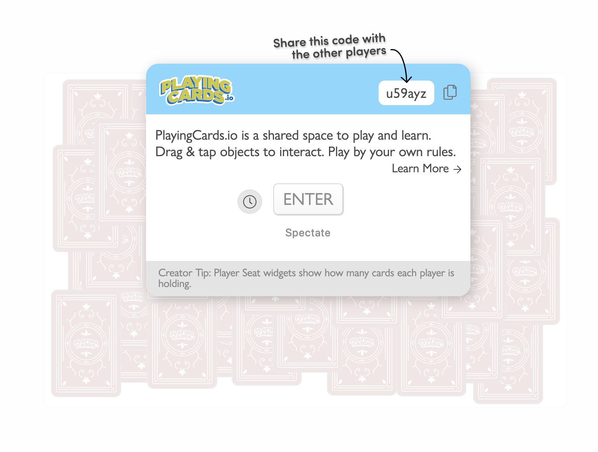

In the game you chose, start getting familiar with how flipping and moving cards work, including placing them in your hand. I chose Go Fish, which has several elements common to most games made using playingcards.io:

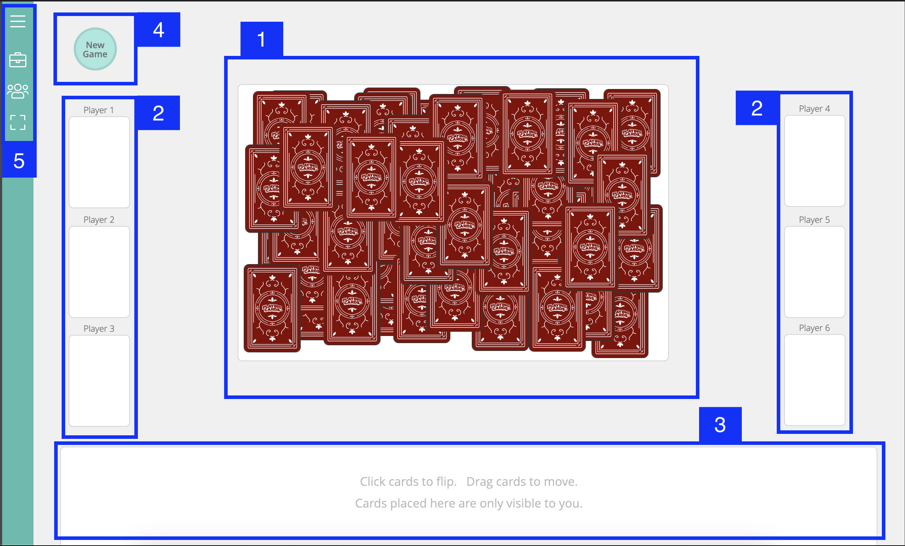

1) The game board itself, with cards place on it.
2) Individual holders for each player, where cards can be placed. Holders can be used per player, to create a discard pile, or for whatever other reason you can think of.
3) The player's hand. Each player should have a hand where they can store cards (unless the game doesn't use them).
4) A "New Game" button which resets the game board. There are many automation features you can create in playingcards.io, but things that shuffle, deal, or otherwise set-up the gameboard are very handy!
5) The menu, with buttons for editing the deck, changing the screen view, and player settings.

Get familiar with the game a bit, so you can understand what your game's experience will be like for your players and the markers.

Like any good game making tool, playingcards.io also has an edit mode. 

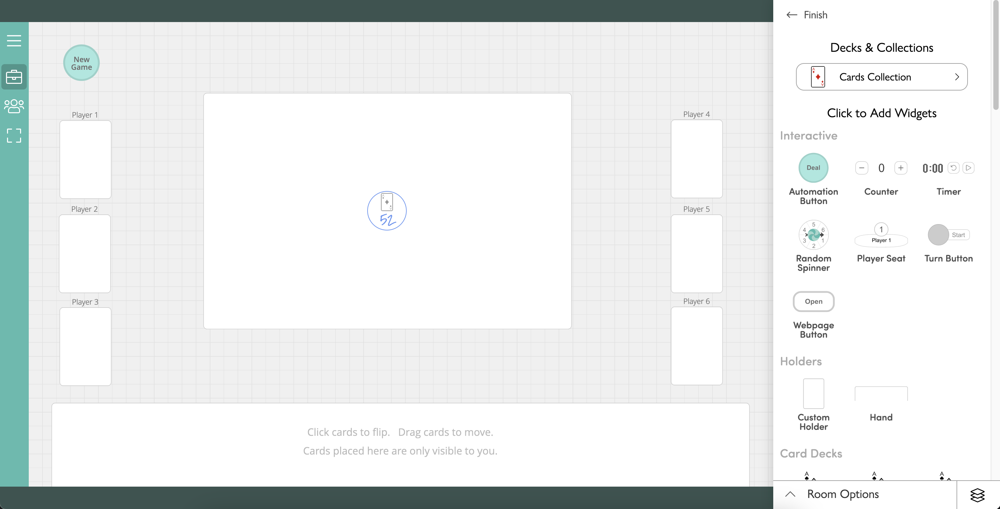

### Playing with a friend
Have another classmate join your game (or join theirs) using the code from before. If you've forgotten it, you can find it by pressing `Players and Sharing > Invite Players` and sending the URL. This is a good chance to just see what it is like to play with someone else using this tool.

## Creating a "room" (20 min)
You can create a new blank room by pressing the small plus button on the main page next to your username, then selecting `Start Blank Room.`

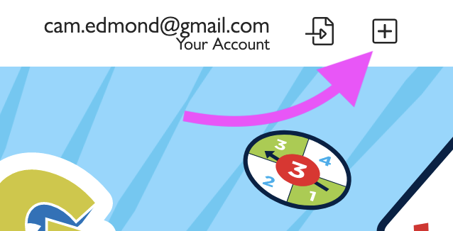

When you start with a blank room, you'll see a screen like the one below. The big grey space is your table, whereas the white rectangle down the bottom is your "hand". You have a hand even if not set as a player.

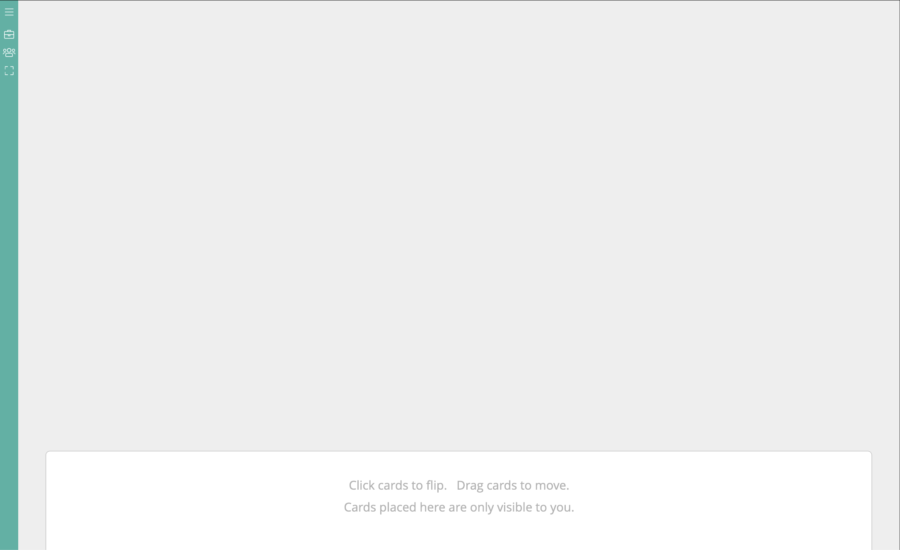

You can begin to edit and add things to your game by pressing the "Edit Table" button, shaped like a little briefcase icon.

## Creating a custom deck (20 min)
When you make your assignment, you will want to be using custom cards. We do not expect you to have started creating these yet, so instead we will just get familiar with the workflow for doing so.

When editing your game, you can add a standard set of cards (for playtesting only, not for your submission!) or a "Custom Card Deck". To add a Custom Card Deck, simply drag it from the Card Decks folder and place it onto your table.

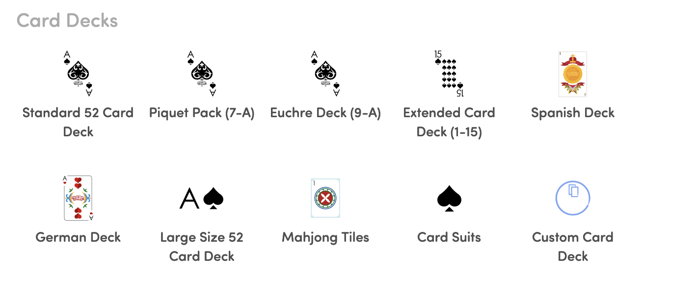

The card deck should then appear as below. The number "0" represents how many cards are actually in the deck. To start making and adding cards, press the "Edit Collection" button.

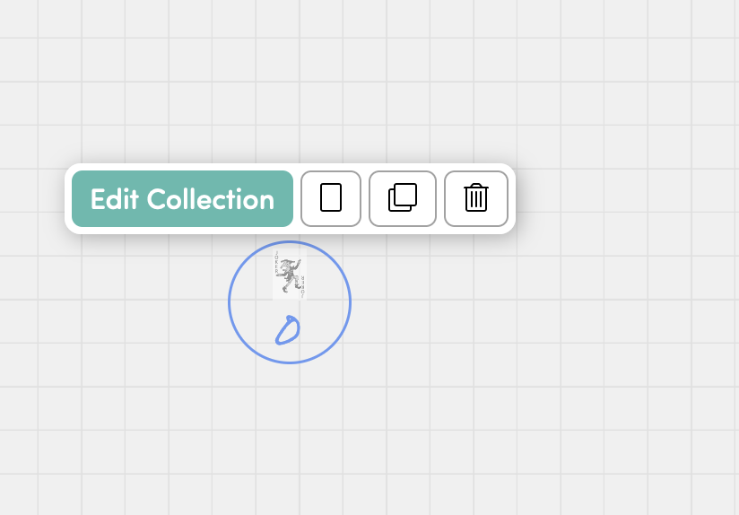

This will give you a list of different cards, each with a name, an image and design, as well as how many copies exist in the deck (so you can have rare cards and common cards, for instance). You can add more cards to this list, or simply work with the ones that appear here and modify them. To have a  card appear in the deck, you must first increase its count by pressing the small plus button next to is number. It is a good idea to rename your cards, too.

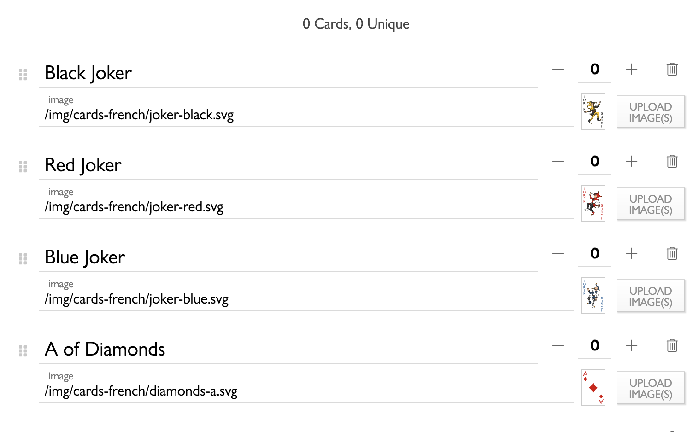

When you want to change the design on the card, press the "Upload Image(s)" button. If you want to try this out, you'll need an image. A good resource is [The Public Domain Image Archive](https://pdimagearchive.org). This is a collection of images that are in the public domain, making them completely free to use. Have a quick browse and find something you like. Don't be too selective here, this is just for today's task.

Here, you can upload images and add text to both the face and back of the card (switching between them by selecting "face" or "back"). You can also set a few other aesthetic options such as if the cards are rounded, have a heavy border, etc.

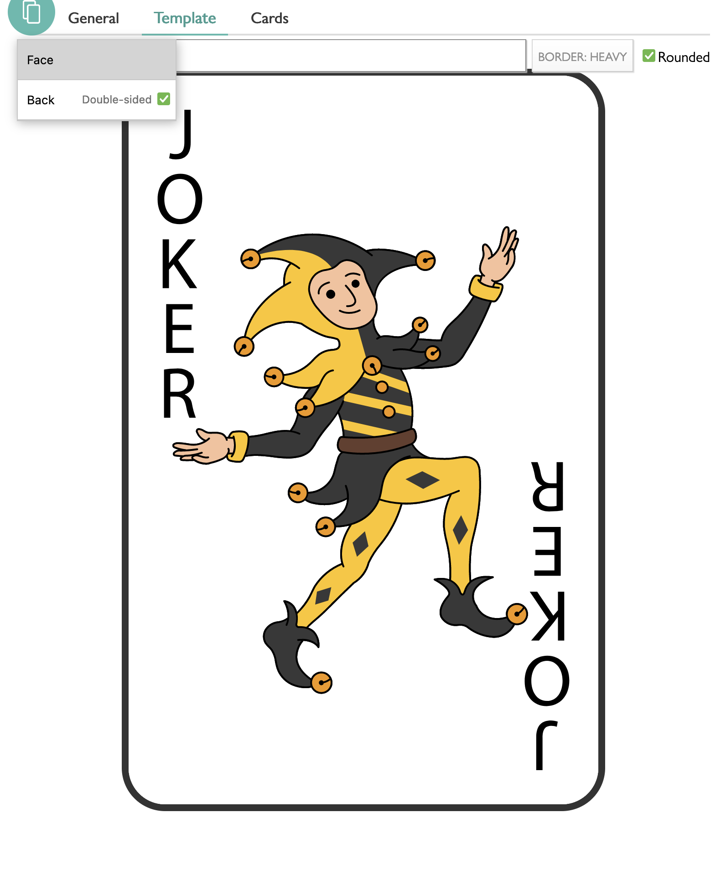

Importantly, you can set whether all cards in a deck have the same text on them, or the same image on the front or back by changing the setting to the right when uploading an image. By default, this is often set to "All the Same", so make sure you double-check it before making changes. You may want it set to "All the Same" for back images, for instance, so your players can keep track of what cards belong to what decks.

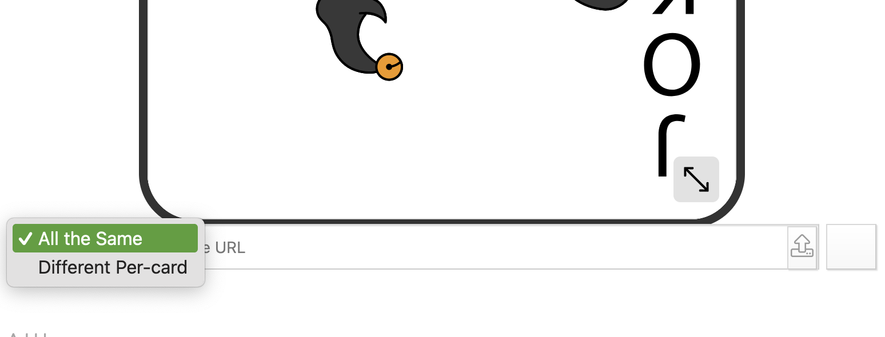

Finally, you can set the overall properties of the deck via the "General" tab. We recommend turning on "Enlarge objects" as this makes it easier for players to see what cards can do. Set the other settings as you see fit, but I'd imagine "Flip Card" should probably be turned on.

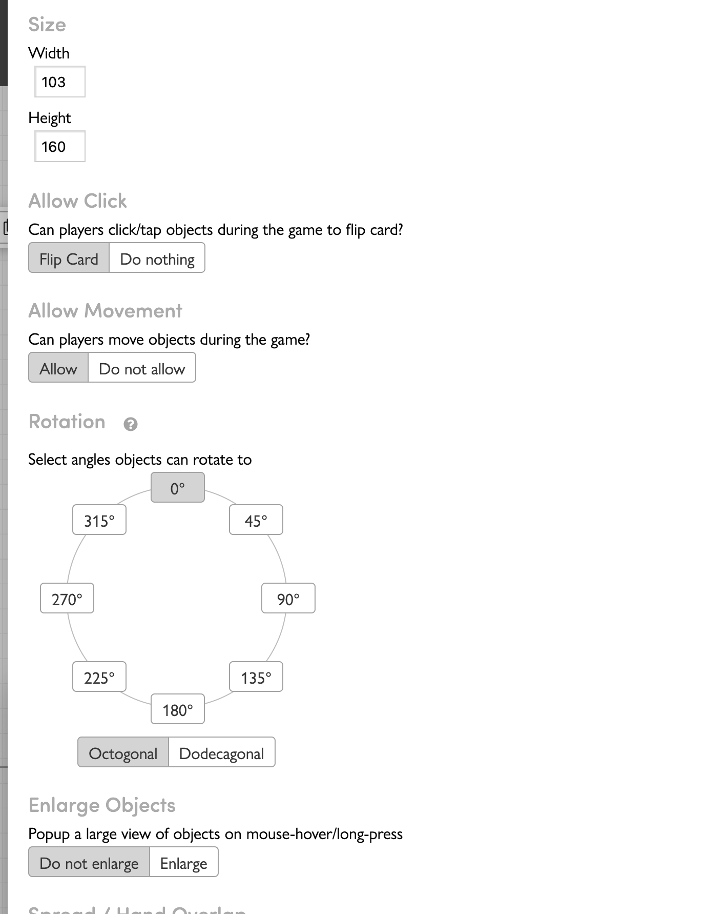

### Other features
Below is a quick run-down of other features within playingcards.io. You are not expected to use or experiment with these now, but we wanted you to have a good understanding of what you can work with for this assignment. You may wish to re-visit this prac in the future as a quick reference guide. There is more info on all of this in the [playingcards.io documentation](https://playingcards.io/docs/).

#### Game Pieces
Just like with cards, you can place other game pieces into your table. These operate much like cards in that you can have them custom made. Any of these types of pieces are validly used for resources in your game as per the spec, as long as it is clear what is what.

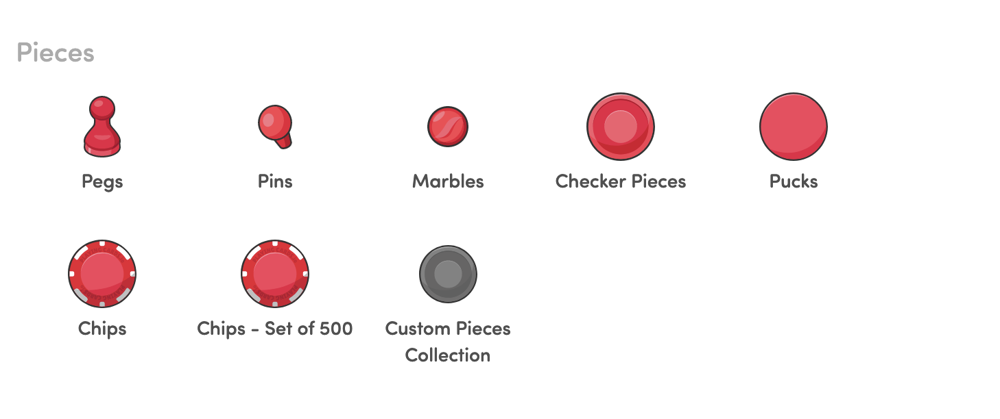
If you wish to edit custom pieces, the interface is much the same as for cards.

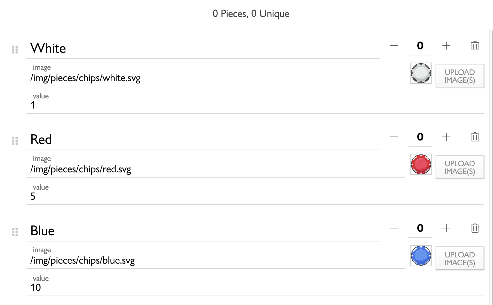

Game boards can also be used. You may wish to use these for some sort of "minimap" per player to track resources, as per the assignment spec. Feel free to get creative!

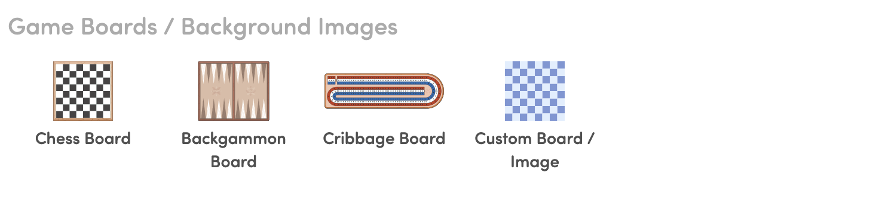

#### Interactive Pieces and Player Seats
Interactive pieces such as reset buttons, player seats and timers are useful for making your game easier to play digitally. Remember that anything you use here you'd need to be able to replicate in your paper prototyping.

##### Player Seats
Although it doesn't appear player seats are necessary to play games using the platform, they certainly make life easier. Player Seats can be used to allow players to select a "Seat" and be given control over all the resources associated with it. This might include dice, timers, resources, cards, etc. To link a player seat with resources, first make sure they are all present on the table, then select the Player Seat options and click "Link Widgets". Each element you select will become linked to this player.

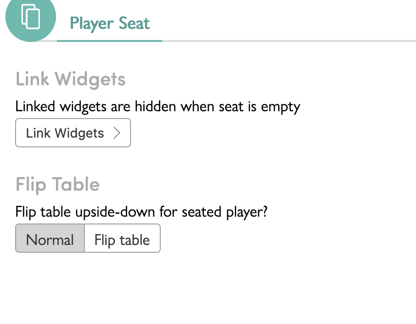
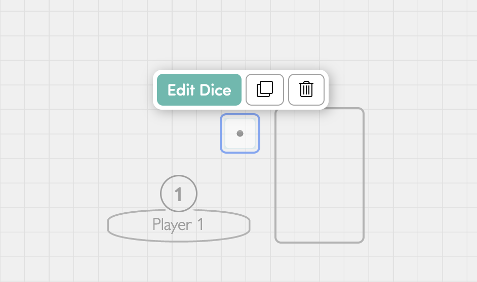
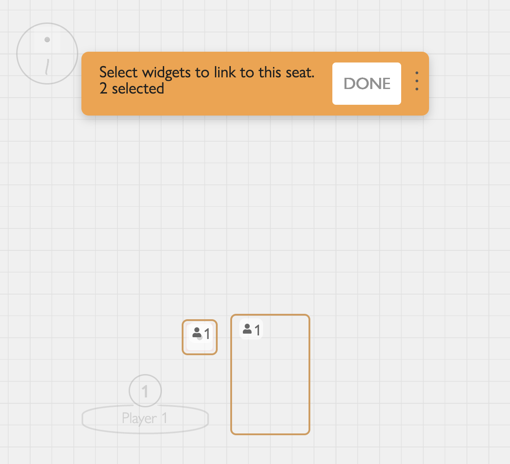

## Saving The Game (10 min)
You can export your game from the room settings. This will save the table state, any linked widgets, and the images for your cards ready for distribution. You can then reimport it to continue where you left off. 

Remember that this also saves the table state, so make sure what you submit to us at the end is a game ready to go, not one in progress (we recommend having a separate "master file" that you only over-write with ready-to-submit versions of the game and keep your testing files separate).

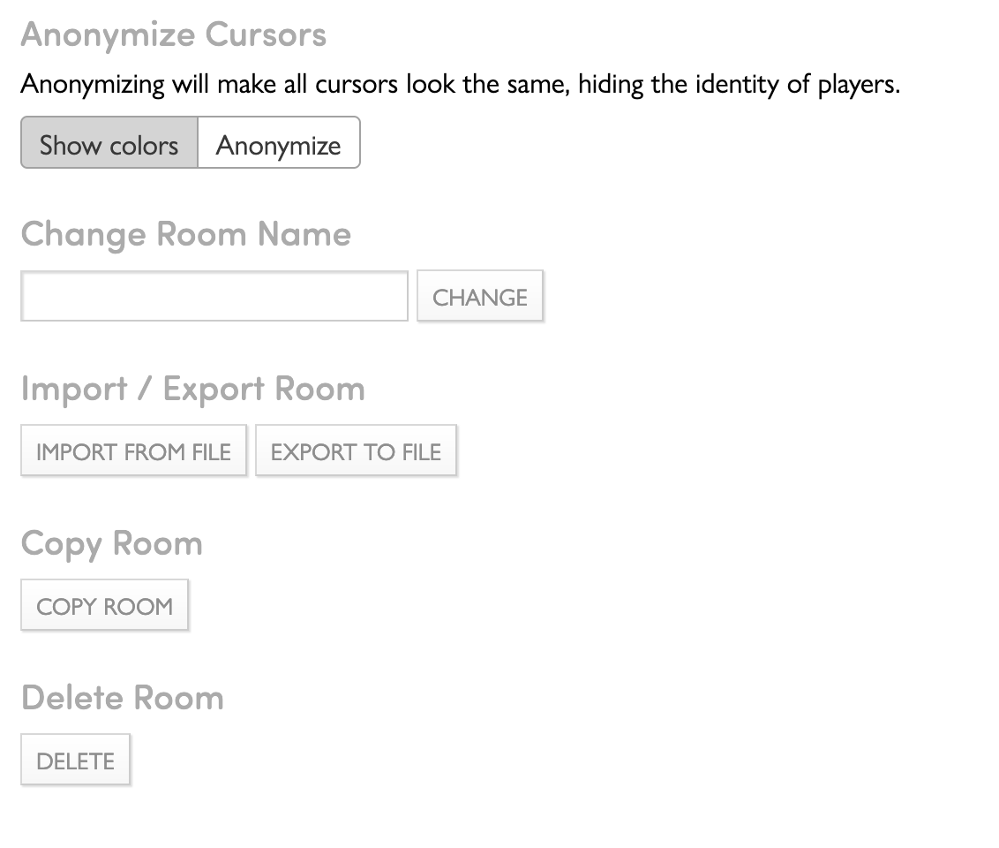